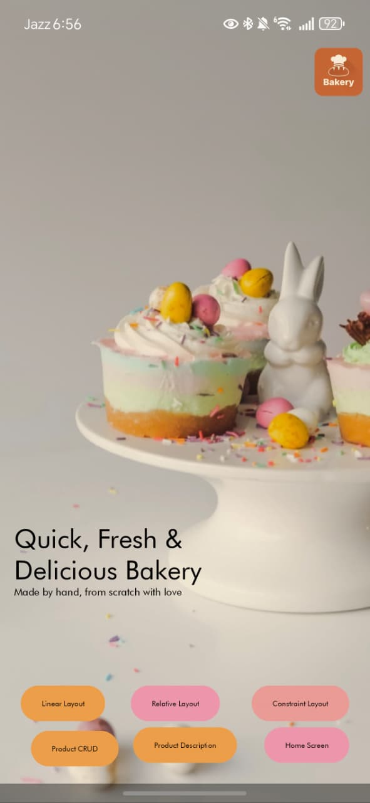
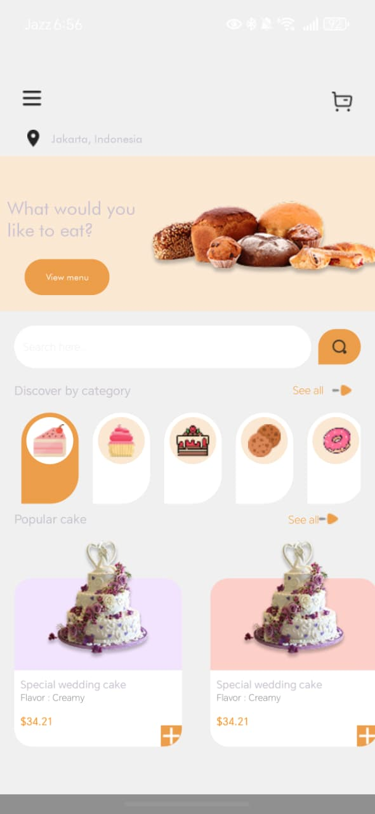
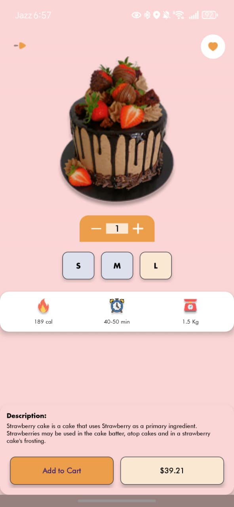
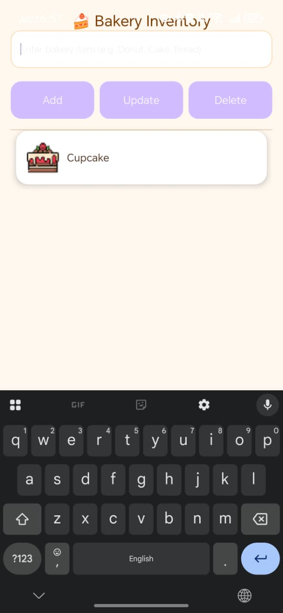
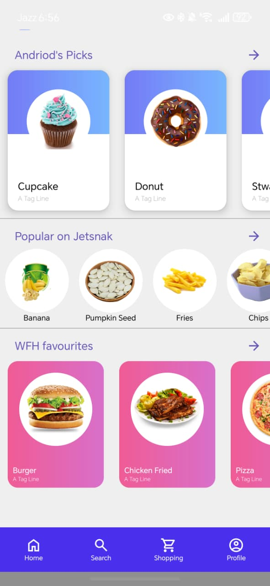

# 🍰 Bakery-App (Created By : Talha Shafique)
Bakery App

## 🧁 Description Bakery App
The Sweet Spot Bakery App offers a delightful and intuitive mobile experience for ordering, viewing, and managing bakery items. It prioritizes a seamless GUI developed using XML Layouts and View-based UI for customers and staff alike, allowing for easy navigation, item selection, and order management. The application features comprehensive screens supporting the CRUD operations necessary for a modern menu: adding new products (Create), browsing categories and product details (Read), updating item information or quantities in a cart (Update), and removing items or cancelling orders (Delete). The focus remains entirely on a well-designed, user-friendly layout and interaction flow.

## ⚙️ Technologies Used (XML-Based)
- 💻 **Language:**  Kotlin
- 🎨 **UI Framework:** Android XML Layouts (View-based UI)
- ⚙️ **Views:** RecyclerView, ConstraintLayout, Material Design Components,RelativeLayout, LinearLayout
- 🖼️ **Image Loading:** Glide or Picasso
- 🧭 **Navigation:** Android Navigation Component (with XML graph)
- 📱 **App Layouts:** GUI & CRUD

## 📱 App Screenshots

| **1. Splash Screen** | **2. Home Screen** | **3. Product Description Screen** | **4. CRUD Screen** |
| :---: | :---: | :---: | :---: |
|  |  |  |  |
| **5. Linear Layouts Screen** | **6. Relative Layouts Screen** | **7. Constraints Layouts Screen** | 
|  |  |  |
